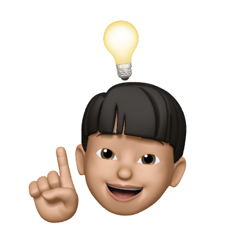

# Pard-Longkerton-Project-DotZiP

   
  
   

## 💻 프로젝트 소개

나를 발견할 수 있는 질문들을 통해 지인들이 바라보는 모습,  나도 몰랐던 나의 새로운 모습을 키워드로 발견하도록 투표 기반의 서비스를 제공합니다.

## 🖥️ 배포 주소
[.ZiP 방문하기📂](https://dotzip.swygbro.com)

## 🕰️ 개발 기간
* 23.06.19일 ~ 23.07.08일 (3주 프로젝트)

### 🧑‍🤝‍🧑 맴버구성
###### 이미지 클릭 시 각 팀원의 소개 페이지로 이동
|  기획자 배예진    |  디자이너 조세희     |   웹개발자 김현승   |   웹개발자 이한나  |  웹개발자 김지수  |
|   :--------:   |    :--------:    |    :--------:  |    :--------:   |   :--------:  |
|     |      |          |         |         |

 

## ⚙️ 기술 스택

|  Notion    |  Figma     |  React   |  Firebase |
| :--------: | :--------: | :------: | :----:    |
|   ![nt]    |   ![fm]    | ![react] | ![fb]     |

 

## 📌 주요 기능

### 로그인
- 카카오톡 로그인
- 최초 로그인한 유저일 경우 firestore에 정보 저장
### 홈 페이지
- 최근 생성한 질문 2개 
- 질문 생성하기
### 질문만들기
- 주어진 질문으로 질문 폴더 만들기
- 유저가 새로운 질문 생성하여 질문 폴더 만들기
- 본인 질문에 답변 추가하기 (투표 항목 추가)
### 투표하기
- 투표 항목 새롭게 추가하기 (닉네임, 새로운 답변, 이유 추가)
- 기존 투표 항목에 투표하기 (닉네임, 이유 추가)
- 새로운 질문 만들기
### 투표 결과 확인 페이지
- 총 투표 참여자와 각 항목 득표수와 이유 공개 (%로 항목들 비교)
- 질문자 본인이 추가한 투표 항목 표시 (체크)
- 최대 득표 항목 표시
- 카카오톡 공유
- 링크 복사
- 투표 종료하기
### 생성한 질문 폴더 페이지
- 질문 생성 시간 순으로 질문 폴더 나열
- 해당 질문 폴더 링크 복사하기
- 종료된 질문 폴더는 아래로 이동
### 마이 프로필 페이지
- 모든 투표 항목 중 top3를 랭킹으로 공개
- 닉네임 수정하기
- 카카오톡 마이프로필 랭킹3 공유하기
- 이미지 저장하기
### 환경 설정 페이지
- 문의하기
- 팀소개
- 약관
- 로그아웃

 

 

<!-- Stack Icon Refernces -->

[nt]: /readme/notion.svg
[fm]: /readme/figma.svg
[react]: /readme/react.svg
[fb]: /readme/firebase.svg
